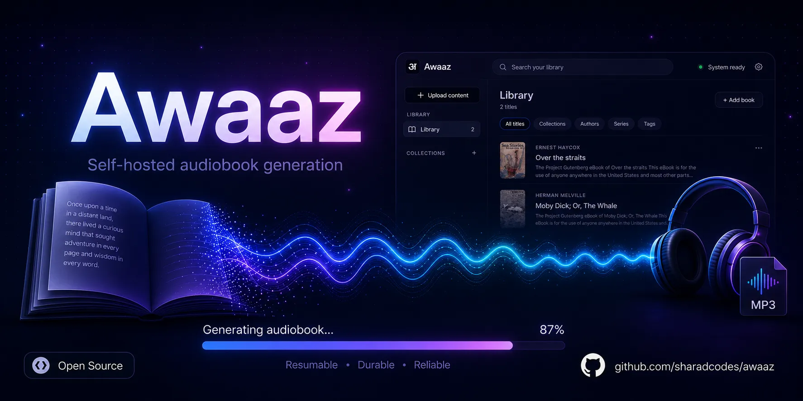
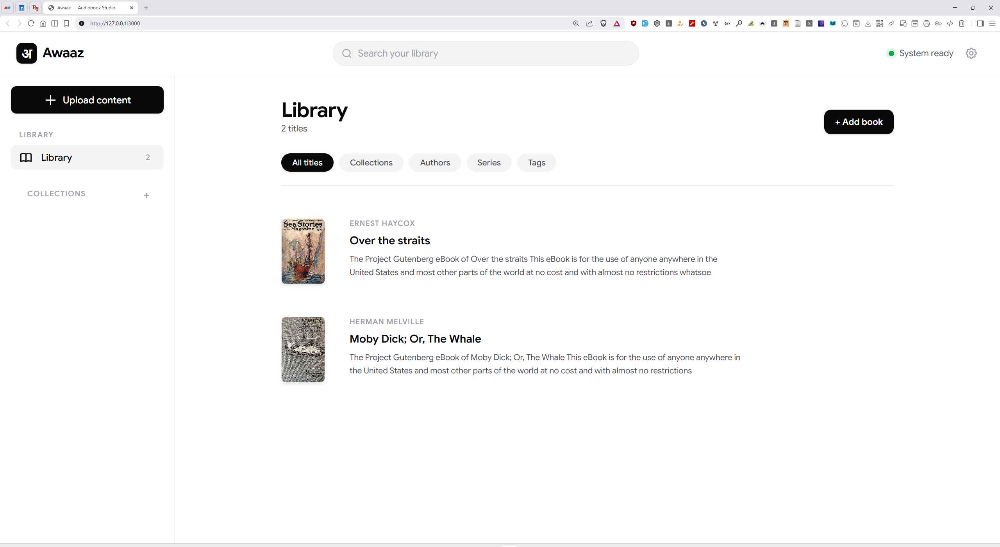
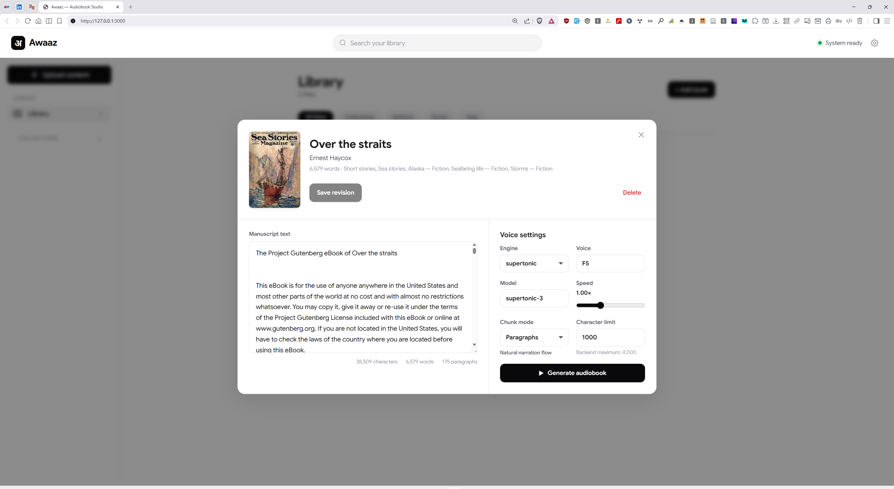
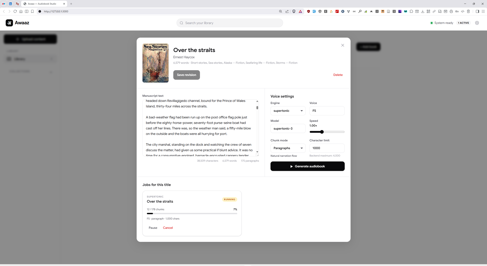
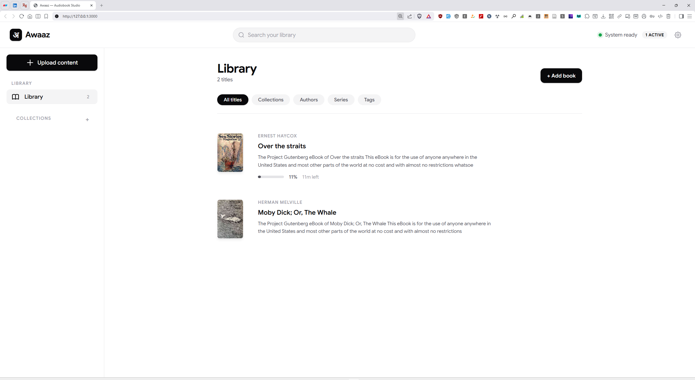
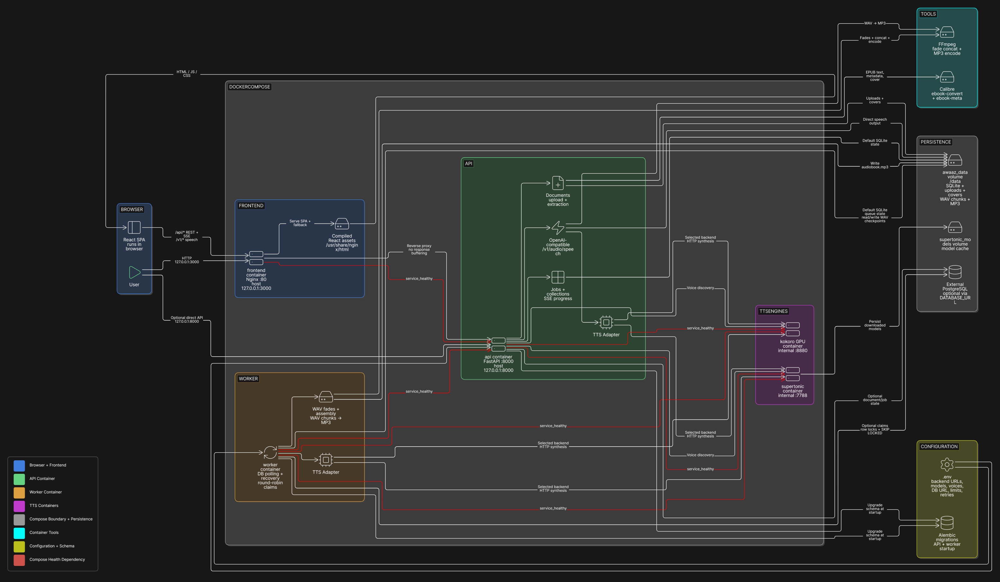

# Awaaz

<p align="center">
  
</p>

<p align="center">
  <a href="https://github.com/sharadcodes/awaaz/actions/workflows/ci.yml"></a>
  <a href="https://github.com/sharadcodes/awaaz/releases"></a>
</p>

**Resumable, API-first audiobook generation for long-form content.**

Awaaz turns EPUB, TXT, or pasted text into MP3 audiobooks through a browser-based library
and a versioned REST API. Long documents become durable synthesis jobs instead of one fragile
TTS request: text is chunked, progress is persisted, failed work can be retried, and completed
WAV chunks survive worker restarts.

## Table of contents

- [Why Awaaz is technically interesting](#why-awaaz-is-technically-interesting)
- [Product capabilities](#product-capabilities)
- [Product tour](#product-tour)
- [Architecture](#architecture)
- [Stack](#stack)
- [Run locally](#run-locally)
- [Typical workflow](#typical-workflow)
- [API-first usage](#api-first-usage)
- [Development checks](#development-checks)
- [Repository layout](#repository-layout)

<p align="center">
  <a href="docs/screenshots/library-overview.png">
    
  </a>
</p>

## Why Awaaz is technically interesting

| Engineering concern | Awaaz approach |
| --- | --- |
| Long inputs and backend limits | Deterministic paragraph, sentence, line, character-limited, and whole-text chunking |
| Expensive or interrupted synthesis | Durable chunk state, atomic WAV checkpoints, startup recovery, and bounded retries |
| Fairness across multiple books | Database-backed worker with round-robin job selection |
| Vendor coupling | Adapter boundary for OpenAI-compatible TTS services |
| Partial or noisy audio output | Short boundary fades followed by FFmpeg concat and 128 kbps MP3 encoding |
| User-visible progress | Per-chunk progress, job controls, downloadable output, and an SSE progress endpoint |
| Data evolution | Alembic migrations with SQLite defaults and optional PostgreSQL support |

## Product capabilities

- Import EPUB/TXT files or create documents from pasted text.
- Extract EPUB text, metadata, and cover art with Calibre.
- Search and organize a library by collection, author, series, and tag.
- Edit extracted manuscripts with optimistic revision checks.
- Select backend, model, voice, speed, chunking strategy, and character limit with a live chunk-count preview.
- Pause, resume, cancel, inspect, and retry synthesis jobs.
- Generate through bundled Supertonic and Kokoro services or a custom OpenAI-compatible endpoint.
- Use the UI, versioned REST API, or OpenAI-compatible `/v1/audio/speech` endpoint.

## Product tour

<table>
  <tr>
    <td width="50%">
      <a href="docs/screenshots/audiobook-configuration.png">
        
      </a>
    </td>
    <td width="50%">
      <a href="docs/screenshots/active-job-progress.png">
        
      </a>
    </td>
  </tr>
  <tr>
    <td><strong>Configure narration.</strong> Edit manuscript text, choose engine and voice, tune speed, then select chunking limits.</td>
    <td><strong>Control durable jobs.</strong> Track processed chunks and progress, then pause or cancel active synthesis.</td>
  </tr>
</table>

<p align="center">
  <a href="docs/screenshots/library-job-progress.png">
    
  </a>
  <br>
  <sub>Job progress remains visible from the main library.</sub>
</p>

## Architecture



Awaaz separates request handling from long-running synthesis. FastAPI persists documents,
jobs, and chunks. A dedicated worker claims pending chunks, calls the selected TTS service,
stores WAV checkpoints, and assembles the final MP3. API and worker share durable `/data`
storage; PostgreSQL can replace the default SQLite database when stronger concurrent claim
semantics are needed.

## Stack

| Layer | Technology |
| --- | --- |
| Frontend | React 19, TypeScript, Vite, Nginx |
| API | Python 3.12, FastAPI, Pydantic, Uvicorn |
| Persistence | Async SQLAlchemy, SQLite/PostgreSQL, Alembic |
| Background processing | Durable database queue, round-robin worker, restart recovery |
| Media pipeline | Calibre, FFmpeg, WAV checkpoints, MP3 assembly |
| TTS integration | OpenAI-compatible adapters, Supertonic, Kokoro, custom backends |
| Quality | pytest, strict mypy, Ruff, Jest, Testing Library, ESLint, Prettier |
| Delivery | Pinned container images, a multi-stage frontend build, and Docker Compose health checks |

## Run locally

### Requirements

- Docker Engine or Docker Desktop with Compose v2.
- NVIDIA GPU and NVIDIA Container Toolkit for the bundled Kokoro GPU container.
- Free local ports `3000` and `8000`.

### Tested hardware

GPU synthesis has only been validated on the configuration below. Other setups may work but are unverified.

| Platform | GPU | Status |
| --- | --- | --- |
| Windows | NVIDIA GeForce GTX 1650 | Tested |
| macOS (Apple Silicon, Metal/MLX) | — | Not tested |
| Linux (AMD ROCm) | — | Not tested |
| Linux (NVIDIA) | — | Not tested |

CPU-only runs and OpenAI-compatible remote backends do not require a local GPU.

```bash
cp .env.example .env
docker compose up --build
```

PowerShell equivalent for the first command:

```powershell
Copy-Item .env.example .env
```

Open:

- UI: <http://127.0.0.1:3000>
- API: <http://127.0.0.1:8000>
- OpenAPI: <http://127.0.0.1:8000/docs>

Compose starts the frontend, API, worker, Supertonic, and GPU-backed Kokoro services. Runtime
settings live in `.env`; secrets remain outside source control. On Windows and macOS, use
`host.docker.internal` when a custom TTS service runs directly on the host.

## Typical workflow

1. Upload an EPUB/TXT file or paste text.
2. Review and edit the extracted manuscript.
3. Choose a TTS backend, voice, speed, and chunking mode.
4. Start a durable job and monitor chunk-level progress.
5. Pause, resume, cancel, or download the completed MP3.

## API-first usage

Create a document:

```bash
curl -X POST http://127.0.0.1:8000/api/v1/documents \
  -H "Content-Type: application/json" \
  -d '{"title":"Example","text":"Text to narrate."}'
```

Create an audiobook job using the returned document ID:

```bash
curl -X POST http://127.0.0.1:8000/api/v1/documents/DOCUMENT_ID/jobs \
  -H "Content-Type: application/json" \
  -d '{
    "backend":"kokoro",
    "voice":"af_bella",
    "speed":1.0,
    "chunking_mode":"paragraph",
    "character_limit":1000
  }'
```

Key endpoints:

- `GET /api/v1/jobs/{job_id}` — current state and aggregate progress.
- `GET /api/v1/jobs/{job_id}/events` — server-sent progress events.
- `GET /api/v1/jobs/{job_id}/chunks` — chunk-level state and failures.
- `POST /api/v1/jobs/{job_id}/pause|resume|cancel` — lifecycle control.
- `GET /api/v1/jobs/{job_id}/download` — completed audiobook.
- `POST /v1/audio/speech` — OpenAI-compatible short-form speech.

See [API workflow](docs/api.md) for full request examples.

## Development checks

Fast local checks (requires `uv` and `npm`):

```bash
# Backend
uv sync --group dev
uv run ruff check .
uv run mypy src/awaaz
uv run pytest

# Frontend
cd frontend
npm ci
npx tsc --noEmit -p tsconfig.app.json
npx jest
npx vite build
```

All checks also run inside Docker to match project dependencies and system tools:

```bash
# Backend tests and coverage
docker compose --profile test run --rm test

# Python lint, format, and strict type checks
docker compose --profile test run --rm test uv run --group dev ruff check src tests
docker compose --profile test run --rm test uv run --group dev ruff format --check src tests
docker compose --profile test run --rm test uv run --group dev mypy src

# Frontend tests, lint, and formatting
docker compose --profile test run --rm frontend-test
docker compose --profile test run --rm frontend-test npm run lint
docker compose --profile test run --rm frontend-test npm run format:check
```

Backend coverage includes adapters, API contracts, audio assembly, chunking, file validation,
job state transitions, progress calculation, queue fairness, retries, and worker recovery.
Frontend tests cover API behavior, generation settings, and job controls.

## Repository layout

```text
src/awaaz/          FastAPI application, domain logic, adapters, and worker
frontend/           React + TypeScript client and Nginx runtime image
tests/              Backend unit and integration tests
alembic/            Database migrations
docker/supertonic/  Supertonic container build
docs/               API, architecture, and diagram sources
compose.yaml        Local application and test topology
```

More detail: [architecture notes](docs/architecture.md).

## Creator & License

- **Author:** Sharad Raj Singh Maurya
- **License:** [MIT License](LICENSE) (see [LICENSE](LICENSE) for details)
